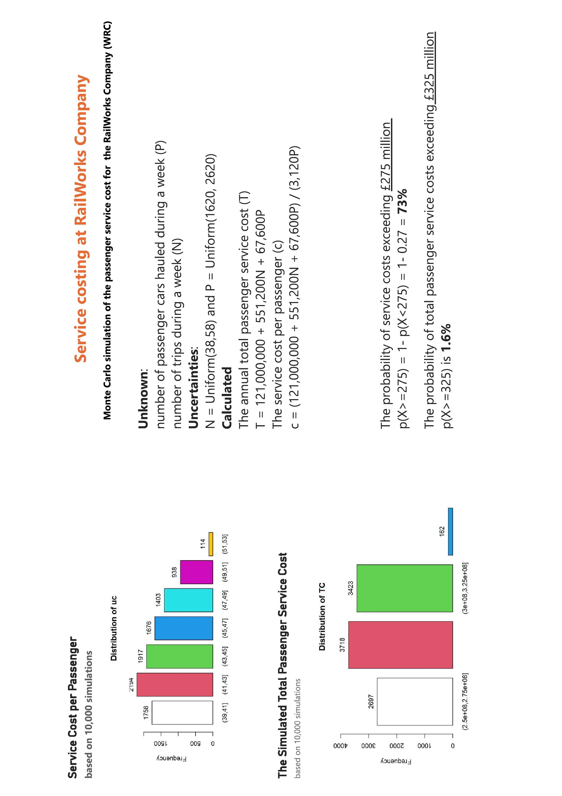
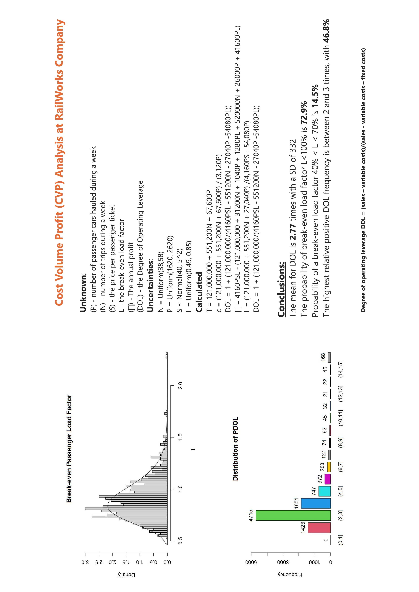
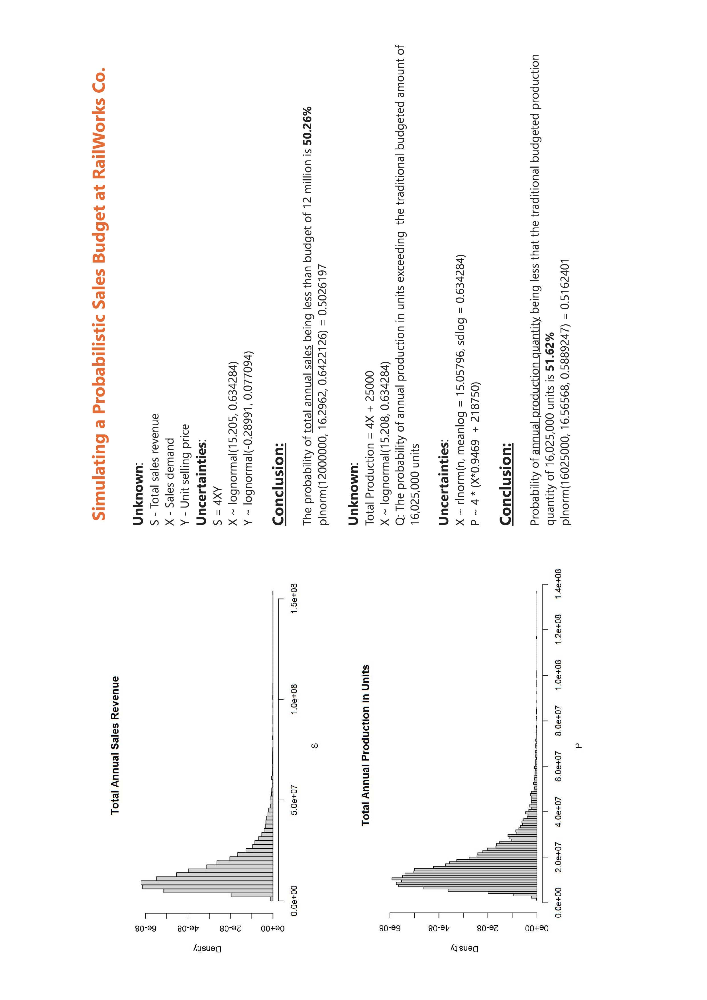
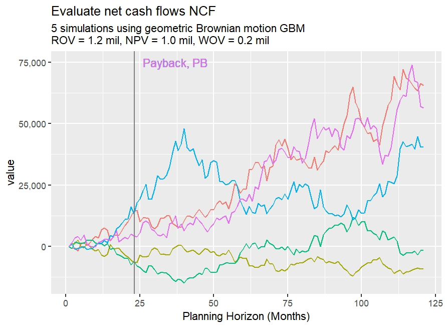

# Data  Science using R

## Predictive Analytics under uncertainity using Monte Carlo simulation

Discussing process and experimenting with Monte Carlo simulation.

 ### Service costing in R using Power BI

### Cost Volume Profit (CVP) Analysis.

### Financial budgeting under uncertainity

 ### A simple example to illustrates the power of real options through the execution of an option to wait.		
			
Problem: Given a set of state variables and associated net cash flows for an investment project simulated through Monte Carlo simulation, solve for the real option value of a capital investment project through the least-squares Monte Carlo simulation (LSM) method.	

**Assumptions:** 	
Operating costs of the project are fixed	 
Revenues are dependent upon a stochastically evolving underlying asset that follows a GBM process	 
The project can be invested at the beginning of each month (i.e. dt = 1/12) of the year.	 
Cash flows are delivered at the end of each month. 	 
There is a construction time of 6 months considered in this investment project, which means there is 6 months between the initial capital investment and when net cash flows of the project are accrued. 	 
The initial capital investment cost also decreases exponentially at a rate of 1% p.a. to allow research and development into the project to reduce the cost of investment.	 
Initial price of asset: 36  
Discrete time step = 1/12 (monthly)  
Project lifetime (in years) = 10 
Capital investement = 100,000   
**Results** 
'Real Option value': The value of the capital investment project considering flexibility in the timing of investment. **(1.2mil)** 
'Net Present Value': The value of the capital investment project considering immediate investment. **(1.0 mil)** 
'Waiting Option Value': The value of the option to delay initial investment, equal to the difference between the ROV and NPV **(0.2 mil)**

	
### Customer Segmentation using R
Discussing process and experimenting with clustering  
Using **KMeans** for Segmenting Customers and determining the Optimal value of K using Elbow Method.  
 
From the second visualisation, we observe that there is a distribution of 6 clusters as follows 
 
Cluster 1: This Cluster represents the customers who have a low Annual Income as well as a low Annual spend. 
Cluster 2: This Cluster represents the customers who have a high Annual Income but spends low. 
Cluster 3 + 4: This Cluster represents the customers having a medium Annual Income as well as a medium Annual spend, with two age groups, up to 40 and above. 
Cluster 5: This Cluster represents the customers having a low Annual Income but spends way too much. 
Cluster 6: This Cluster represents the customers having a very high Annual Income along with a high spending.

